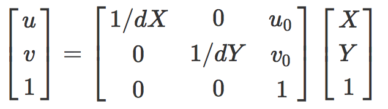
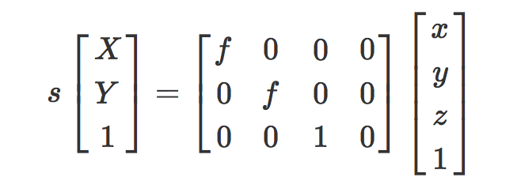
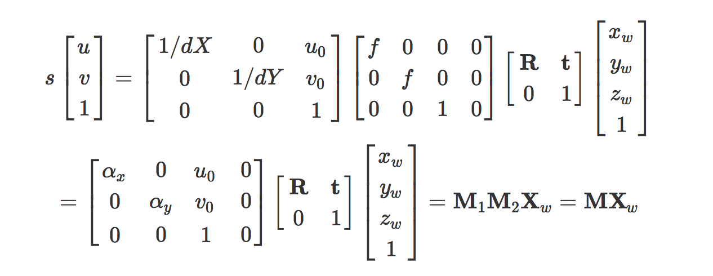
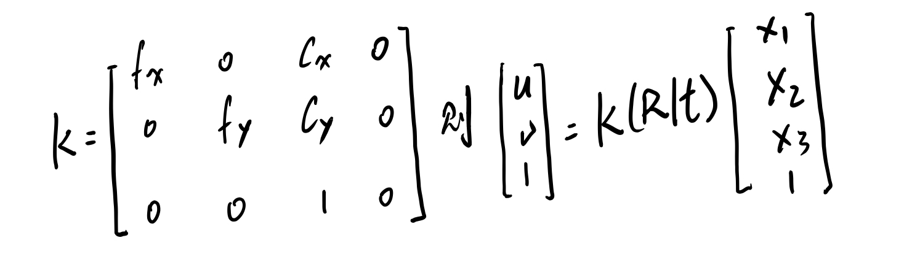

## Camera Basics

#### 1. What are the intrinsics and extrinsics of a camera? [(Learn about camera model)](https://en.wikipedia.org/wiki/Camera_resectioning) What is the camera matrix? Write down your answers.

相机的成像过程，就是一个将三维世界中的物体投影到一个二维成像平面上的一个过程。

在这个过程中，我们把物体的坐标转换分成两个部分。一个是坐标的旋转和平移，这部分产生了外参（extrinsics）；第二部分主要是世界坐标到相机内部坐标变换和针孔成像模型，使图片投影到成像平面上，这部分需要用到的参数是(intrinsics).

* intrinsics：所谓内参，就是只与相机本身有关，与相机的拍摄角度方向无关。相机内参通常有如下这些：

  * 坐标变换：有世界坐标XOY（图像坐标，这里假设标定板所在平面是z=0平面，方便操作）和相机内部坐标uov（像素坐标），需要将XOY中的坐标转化到uov上。则有

    

    * $u_0、 v_0$：XOY原点在uov中的坐标
    * $d_X、d_Y$：XOY中的单位长度在uov中的长度，分别是X和Y轴方向的

  * 针孔成像：

    

    * s：比例因子
    * f：有效焦距（光心到图像平面的距离）

* extrinsixs：与相机本身无关，比如相机的倾斜角度，相对物体的平移距离。包括：

  * 旋转矩阵: Rotation Matrices 
  *  平移向量: Translation Vectors 

* camera matrix：由相机内参构成的矩阵。我们综合考虑上面所讲的intrinsics和extrinsics。有如下方程：

  

  

  当然，我们定义世界坐标的时候为了方便起见，将$z_w$设置为0。那么$M_1$中的最后一列和$M_2$中的最后一行，还有$z_w$可以省略掉不写。

  那么剩下来的3 * 3的$M_1$就是camera matrix

  

#### 2. (Camera Imaging) Given an ordinary camera with focal length $f_x$ and $f_y$ , optical center $(c_x , c_y )$, the transform between the 3D world coordinates and the 3D camera coordinates is (R|t), can you transform a 3D point $X = (X_1 , X_2 , X _3 )$ onto the image plane? (Consider only pinhole camera model. 3D camera coordinate position: front is +Z, left is +X, up is +Y. Image plane: right is +x, down is +y). Write down your answers in matrix form.

这里不考虑内参$d_X,d_Y$，既假设世界坐标中的单位长度和相机内部等成像平面的坐标单位长度相同。

则我们可以得到相机内参矩阵

#### 3. Given a 2D image point (u, v), what shape does it correspond to in the 3D camera coordinate? Can you derive its equation?

这里根据第二题的方程，只要把$K(R|t)$乘到右边来就行了，当然不是直接乘，假设$D =K(R|t)$这是一个3 x 4 的矩阵，如果像之前说的那样不考虑$X_3$那么K的最后一列和$(R|t)$的最后一行也就没有了， 那么这时候D就是一个方阵，那么直接取逆乘到最左边就可以了。如果$X_3 \neq 0$，那就是更一般的情况。

则

$$[u,v,1]^T = K(R|t)[X_1, X_2, X_3,1]^T $$

 $$ [u,v,1]^T = D[X_1, X_2, X_3,1]^T$$

 $$D^T[u,v,1]^T = D^TD[X_1, X_2, X_3,1]^T$$  

$$ [X_1, X_2, X_3,1]^T  = (D^TD)^{-1}D^T[u,v,1]^T$$

ps:这里的等号和一般意义上的等号并不一样，不是指两边矩阵内的所有元素一一对应相等，而是指，两边的矩阵所表示的齐次坐标相等。即如果把最后的其次项都化成1那么就是完全相等的意思。

#### 4. (Distortion) Describe the distortions of the cameras. Given a 2D image point (u, v), can you find its coordinate before distortion? (For simplicity, consider only the distortion model with 4 distortion coefficients, e.g., $k_1 , k_2 , p_1 , p_2 $)

$r^2 = x^2 + y^2$

径向畸变：

$\Delta_rx  = x \times (k_1 * r^2+ k_2 * r^2) $

$\Delta_ry  = y \times (k_1 * r^2+ k_2 * r^2)$

切向畸变：

$\Delta_dx  = 2p_1y + p_2(r^2 + 2x^2) $

$\Delta_dy  = 2p_1x + p_2(r^2 + 2y^2) $

综合考虑:

$x_{correct} = x + \Delta_rx + \Delta_dx = x \times (k_1 * r^2+ k_2 * r^2) + 2p_1y + p_2(r^2 + 2x^2)$

$y_{correct} = y + \Delta_ry + \Delta_dy =  y \times (k_1 * r^2+ k_2 * r^2) +2p_1x + p_2(r^2 + 2y^2) $

#### 5. (Calibration) Describe what the camera calibration does.

相机标定是求出相机内参和外参还有畸变系数的过程

主要步骤：

* 打印一张棋盘格，把它贴在一个平面上，作为标定物。 
* 通过调整标定物或摄像机的方向，为标定物拍摄一些不同方向的照片。  
* 从照片中提取棋盘格角点。  
* 估算理想无畸变的情况下，五个内参和六个外参。
* 应用最小二乘法估算实际存在径向畸变下的畸变系数。  
* 极大似然法，优化估计，提升估计精度。

#### 6. (F Programming) Provided a series of images taken by the camera, can you calibrate the camera with OpenCV functions? (use the images in left.zip. Read more about the APIs in camera calibration 1 section)

这一部分我实现了两个程序，刚开始用的是C++但是做到第8个问题的时候，要自己实现算法，有很多的矩阵操作，所以用Python重新实现了一遍。

算法流程：

#### 7. (F Programming]) Undistort the images with the calibration results you computed. What functions of OpenCV do you use?

步骤以及调用的API：

​	1.用 findChessboardCorners 函数定位图片中棋盘的角点，然后用cornerSubPix函数亚像素级定位角点坐标。

​	2.自定义obj坐标（角点的世界坐标/XOY中的坐标），然后用calibrateCamera函数进行相机标定，得到相机内参，外参和畸变系数

​	3.使用undistort将相机内参和畸变系数传入函数，得到undistort的图像

​	4.用imshow输出观察

#### 8. (FFF Programming) Learn about Zhang’s method [1] for camera calibration. Can you implement Zhang’s method? Report the calibration result with your implemented approach. Compare with the result from Problem 6.

实现过程就是 ““A flexible new technique for camera calibration”这篇论文里所讲的过程，但是没有进行最后的将畸变系数代回去重新优化。

实验结果（由求得的参数将objecPoints重新投影到成像平面上与直接从图片读入的角点坐标之间的方差）:

| 图片编号 |   opencv误差    | MyImplement误差 |
| -------- | :-------------: | --------------- |
| 1        |    0.0217982    | 0.328950581087  |
| 2        |    0.0205259    | 0.586723909617  |
| 3        |    0.0715276    | 1.38569918639   |
| 4        |    0.0270444    | 0.802758246343  |
| 5        |    0.0473898    | 1.08735003376   |
| 6        |    0.129713     | 0.766563670912  |
| 7        |    0.0250551    | 0.254108765454  |
| 8        |    0.0421388    | 0.825077596434  |
| 9        |    0.021043     | 0.389046998672  |
| 10       |    0.0204822    | 0.618654644119  |
| 11       |    0.0295575    | 0.965505039145  |
| 12       |    0.0199109    | 0.247492626284  |
| 13       |    0.0212033    | 0.679387591264  |
| 平均值   | 0.0382607579231 | 0.687486068422  |

结果分析：

虽然可以看到我的结果明显不如调用opencv中接口的准确度高。但是注意到单位是一个像素。所以事实上我实现的算法在精度上也已经有了不错的表现，运行代码，失真校正情况几乎和调用API的结果相同

误差大的原因猜测：

​	没有迭代优化

参数

opencv intrinsics:
 [[ 532.81837346    0.          342.48685551]
 [   0.          532.93663186  233.85769139]
 [   0.            0.            1.        ]]
opencv distortion coefficients:
 [[-0.28086854  0.02509416  0.          0.          0.        ]]

my implement intrinsics:
 [[ 537.61188612   -3.79841404  355.41925703]
 [   0.          540.18711195  234.81359102]
 [   0.            0.            1.        ]]
my implement distortion coefficients:
 [[  2.35102627e-04  -2.93301618e-06   0.00000000e+00   0.00000000e+00
    0.00000000e+00]]

从上面的参数可以看出，相机内参非常相似，说明求的没有什么问题

但是畸变系数差距非常大：

​	实验发现：加上畸变影响，上面提到的误差是变小的。

​	但是畸变系数和调用接口求出来的明显不同，这里还需要多几次实验去证明实验代码本身是否有问题。我也会尽快把迭代优化写一起比较。

至于外参，API给的是旋转向量，我求的是旋转矩阵，即使转换后还是差距很大，没有什么可比性，就没有放上来了

存在问题：旋转矩阵转化成旋转向量还未完成。

#### Reference 

[1] Z. Zhang, “A flexible new technique for camera calibration,” IEEE Transactions on pattern analysis and machine intelligence, vol. 22, no. 11, pp. 1330–1334, 2000.